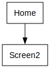

# Power App Documentation \- TestingPurposes

| Property                   | Value                             |
| -------------------------- | --------------------------------- |
| App Name                   | TestingPurposes                   |
| Documentation generated at | Monday, February 17, 2025 2:36 PM |

- [Overview](index-TestingPurposes.md)
- [App Details](appdetails-TestingPurposes.md)
- [Variables](variables-TestingPurposes.md)
- [DataSources](datasources-TestingPurposes.md)
- [Resources](resources-TestingPurposes.md)
- [Controls](controls-TestingPurposes.md)

## Controls Overview

A total of 2 Screens are located in the app.

A total of 82 Controls are located in the app.

### [Screen: Home](screen-Home-TestingPurposes.md)

- [ Home](screen-Home-TestingPurposes.md)
- - [ Container1](screen-Home-TestingPurposes.md)
  - - [ ButtonCanvas3](screen-Home-TestingPurposes.md)
- - [ Header1](screen-Home-TestingPurposes.md)

### [Screen: Screen2](screen-Screen2-TestingPurposes.md)

- [ Screen2](screen-Screen2-TestingPurposes.md)
- - [ ScreenContainer1](screen-Screen2-TestingPurposes.md)
  - - [ BodyContainer1](screen-Screen2-TestingPurposes.md)
    - - [ DeleteConfirmDialogContainer1](screen-Screen2-TestingPurposes.md)
      - - [ ConfirmDeleteButtonBarContainer1](screen-Screen2-TestingPurposes.md)
        - - [ CancelDeleteButton1](screen-Screen2-TestingPurposes.md)
        - - [ ConfirmDeleteButton1](screen-Screen2-TestingPurposes.md)
      - - [ ConfirmDeleteLabelContainer1](screen-Screen2-TestingPurposes.md)
        - - [ TextCanvas1](screen-Screen2-TestingPurposes.md)
    - - [ RightContainer1](screen-Screen2-TestingPurposes.md)
      - - [ Container2](screen-Screen2-TestingPurposes.md)
        - - [ Container21](screen-Screen2-TestingPurposes.md)
          - - [ BackIcon1](screen-Screen2-TestingPurposes.md)
          - - [ DeleteButton1](screen-Screen2-TestingPurposes.md)
          - - [ EditButton1](screen-Screen2-TestingPurposes.md)
          - - [ NewRecordButton1](screen-Screen2-TestingPurposes.md)
      - - [ MainContainer1](screen-Screen2-TestingPurposes.md)
        - - [ ButtonContainer1](screen-Screen2-TestingPurposes.md)
          - - [ CancelButton1](screen-Screen2-TestingPurposes.md)
          - - [ SubmitButton1](screen-Screen2-TestingPurposes.md)
        - - [ Form1](screen-Screen2-TestingPurposes.md)
          - - [ Assigned to\_DataCard1](screen-Screen2-TestingPurposes.md)
            - - [ DataCardKey7](screen-Screen2-TestingPurposes.md)
            - - [ DataCardValue7](screen-Screen2-TestingPurposes.md)
            - - [ ErrorMessage7](screen-Screen2-TestingPurposes.md)
            - - [ StarVisible7](screen-Screen2-TestingPurposes.md)
          - - [ Description\_DataCard1](screen-Screen2-TestingPurposes.md)
            - - [ DataCardKey2](screen-Screen2-TestingPurposes.md)
            - - [ DataCardValue2](screen-Screen2-TestingPurposes.md)
            - - [ ErrorMessage2](screen-Screen2-TestingPurposes.md)
            - - [ StarVisible2](screen-Screen2-TestingPurposes.md)
          - - [ Due date\_DataCard1](screen-Screen2-TestingPurposes.md)
            - - [ DataCardKey6](screen-Screen2-TestingPurposes.md)
            - - [ DataCardValue6](screen-Screen2-TestingPurposes.md)
            - - [ ErrorMessage6](screen-Screen2-TestingPurposes.md)
            - - [ StarVisible6](screen-Screen2-TestingPurposes.md)
          - - [ Notes\_DataCard1](screen-Screen2-TestingPurposes.md)
            - - [ DataCardKey8](screen-Screen2-TestingPurposes.md)
            - - [ DataCardValue8](screen-Screen2-TestingPurposes.md)
            - - [ ErrorMessage8](screen-Screen2-TestingPurposes.md)
            - - [ StarVisible8](screen-Screen2-TestingPurposes.md)
          - - [ Priority\_DataCard1](screen-Screen2-TestingPurposes.md)
            - - [ DataCardKey4](screen-Screen2-TestingPurposes.md)
            - - [ DataCardValue4](screen-Screen2-TestingPurposes.md)
            - - [ ErrorMessage4](screen-Screen2-TestingPurposes.md)
            - - [ StarVisible4](screen-Screen2-TestingPurposes.md)
          - - [ Progress\_DataCard1](screen-Screen2-TestingPurposes.md)
            - - [ DataCardKey3](screen-Screen2-TestingPurposes.md)
            - - [ DataCardValue3](screen-Screen2-TestingPurposes.md)
            - - [ ErrorMessage3](screen-Screen2-TestingPurposes.md)
            - - [ StarVisible3](screen-Screen2-TestingPurposes.md)
          - - [ Start date\_DataCard1](screen-Screen2-TestingPurposes.md)
            - - [ DataCardKey5](screen-Screen2-TestingPurposes.md)
            - - [ DataCardValue5](screen-Screen2-TestingPurposes.md)
            - - [ ErrorMessage5](screen-Screen2-TestingPurposes.md)
            - - [ StarVisible5](screen-Screen2-TestingPurposes.md)
          - - [ Title\_DataCard1](screen-Screen2-TestingPurposes.md)
            - - [ DataCardKey1](screen-Screen2-TestingPurposes.md)
            - - [ DataCardValue1](screen-Screen2-TestingPurposes.md)
            - - [ ErrorMessage1](screen-Screen2-TestingPurposes.md)
            - - [ StarVisible1](screen-Screen2-TestingPurposes.md)
    - - [ SidebarContainer1](screen-Screen2-TestingPurposes.md)
      - - [ AddNewContainer1](screen-Screen2-TestingPurposes.md)
        - - [ AddNewButton1](screen-Screen2-TestingPurposes.md)
      - - [ SearchContainer1](screen-Screen2-TestingPurposes.md)
        - - [ SearchInput1](screen-Screen2-TestingPurposes.md)
      - - [ Table1](screen-Screen2-TestingPurposes.md)
        - - [ Assigned to1](screen-Screen2-TestingPurposes.md)
        - - [ Due date1](screen-Screen2-TestingPurposes.md)
        - - [ Notes1](screen-Screen2-TestingPurposes.md)
        - - [ Priority1](screen-Screen2-TestingPurposes.md)
        - - [ Progress1](screen-Screen2-TestingPurposes.md)
        - - [ Start date1](screen-Screen2-TestingPurposes.md)
        - - [ Title1](screen-Screen2-TestingPurposes.md)
  - - [ HeaderContainer1](screen-Screen2-TestingPurposes.md)
    - - [ Header2](screen-Screen2-TestingPurposes.md)

## Screen Navigation

The following diagram shows the navigation between the different screens.

