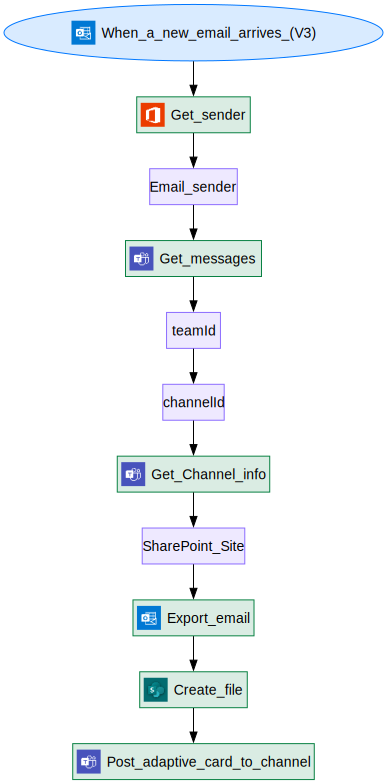

# Flow Documentation \- Forward emails to a channel

| Flow Name                  | Forward emails to a channel              |
| -------------------------- | ---------------------------------------- |
| Flow Name                  | Forward emails to a channel              |
| Flow ID                    | 4f5a2741\-5c9d\-4e58\-81a2\-9d41154f6bd7 |
| Documentation generated at | Thursday, February 13, 2025 5:17 PM      |
| Number of Variables        | 0                                        |
| Number of Actions          | 10                                       |

- [Overview](index-Forward-emails-to-a-channel(4f5a2741-5c9d-4e58-81a2-9d41154f6bd7).md)
- [Connection References](connections-Forward-emails-to-a-channel(4f5a2741-5c9d-4e58-81a2-9d41154f6bd7).md)
- [Variables](variables-Forward-emails-to-a-channel(4f5a2741-5c9d-4e58-81a2-9d41154f6bd7).md)
- [Triggers & Actions](triggersactions-Forward-emails-to-a-channel(4f5a2741-5c9d-4e58-81a2-9d41154f6bd7).md)

## Flow Overview

The following chart shows the top level layout of the Flow. For a detailed view, please visit the section called Detailed Flow Diagram

## Detailed Flow Diagram

The following chart shows the detailed layout of the Flow

